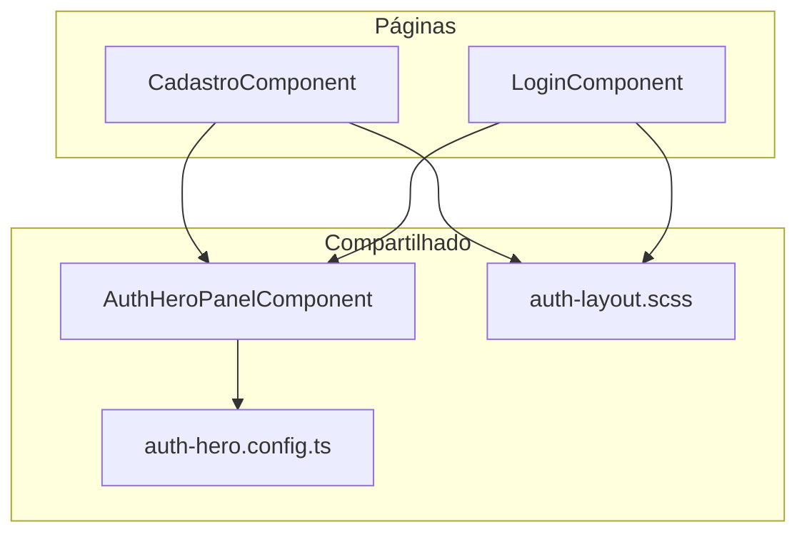
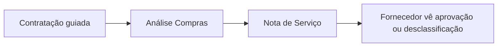
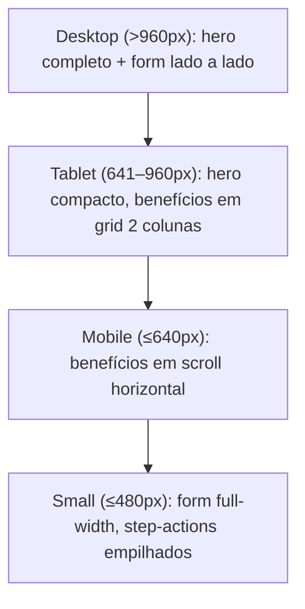
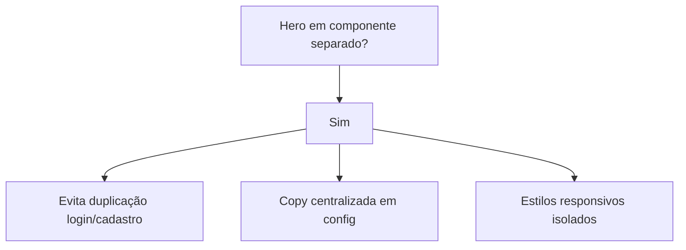

# Redesign das telas de cadastro e login

Documentação do redesign visual das páginas de autenticação do Portal Fornecedor On Demand.

## Objetivo

Elevar a pegada visual das telas de **cadastro** e **login** para transmitir confiança e vontade de se cadastrar, sem alterar a lógica das etapas do wizard (Empresa → Administrador → Confirmar).

## Escopo

| Incluído | Excluído |
|----------|----------|
| Tipografia Plus Jakarta Sans | Lógica de validação/API do cadastro |
| Painel hero reutilizável | Alteração das 3 etapas do formulário |
| Copy de Nota de Serviço e fluxo produto | Backend |
| Responsividade mobile/tablet/desktop | |

## Arquitetura

## Narrativa do produto no hero

O painel esquerdo comunica o valor do portal em três camadas:

1. **Gancho** — badge trial (cadastro) + headline
2. **Mini fluxo** — Contrate → Analise → Receba a nota
3. **Benefícios** — cards glass com destaque para Nota de Serviço

### Copy principal (cadastro)

| Elemento | Texto |
|----------|-------|
| Badge | 15 dias grátis para começar |
| Headline | Crie o portal da sua empresa em minutos |
| Subheadline | Centralize compras, fornecedores e contratações — com transparência para quem presta serviço. |
| Destaque Nota | Nota de Serviço com retorno claro: o fornecedor sabe se foi aprovado ou desclassificado na contratação. |

A variante **login** reutiliza o mesmo componente com headline e benefícios adaptados.

## Tipografia e tokens

Definidos em `src/styles.scss`:

- `--font-family-display` / `--font-family-body`: Plus Jakarta Sans
- `--brand-blue`: #3B82F6
- `--brand-green`: #22C55E
- `--text-primary`: #1E293B

Fonte carregada via Google Fonts em `src/index.html` com `font-display: swap` e fallback `system-ui`.

## Responsividade

| Breakpoint | Comportamento |
|------------|---------------|
| >960px | Layout 2 colunas; hero completo com logo |
| 641–960px | Hero compacto; mini fluxo centralizado; benefícios em grid |
| ≤640px | Benefícios em scroll horizontal (chips); fluxo vertical |
| ≤480px | Card do form com padding reduzido; botões empilhados no cadastro |

**Mudança crítica:** benefícios não somem mais no mobile (antes `display: none` em `.login-hero__features`).

## Arquivos

| Arquivo | Responsabilidade |
|---------|------------------|
| `auth-hero-panel/*` | Componente visual do painel esquerdo |
| `auth-hero.config.ts` | Copy e ícones por variante (`cadastro` \| `login`) |
| `auth-layout.scss` | Grid da página, card do form, campos |
| `cadastro.component.*` | Wizard 3 etapas + integração do hero |
| `login.component.*` | Form de login + integração do hero |
| `styles.scss` | Tokens globais de fonte e cor |
| `index.html` | Link Google Fonts |

## Decisões técnicas

- **Componente reutilizável** em vez de HTML duplicado entre login e cadastro.
- **Config TypeScript** para copy — fácil ajustar textos sem mexer no template.
- **CTA com gradiente** no botão primário via `auth-layout.scss`.
- **Sem alteração de API** — apenas front.

## Validação

1. Desktop: hero completo, mini fluxo, form intacto nas 3 etapas
2. Tablet: benefícios visíveis em grid
3. Mobile: scroll horizontal dos benefícios; form usável
4. Login: mesma identidade visual; tenant badge preservado
5. `npm run build` sem erros
