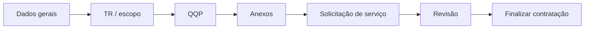
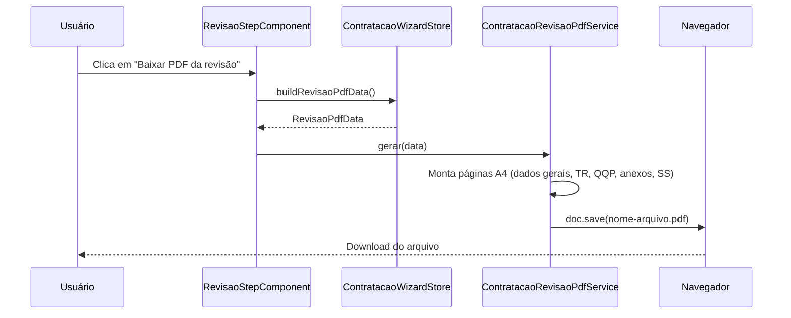
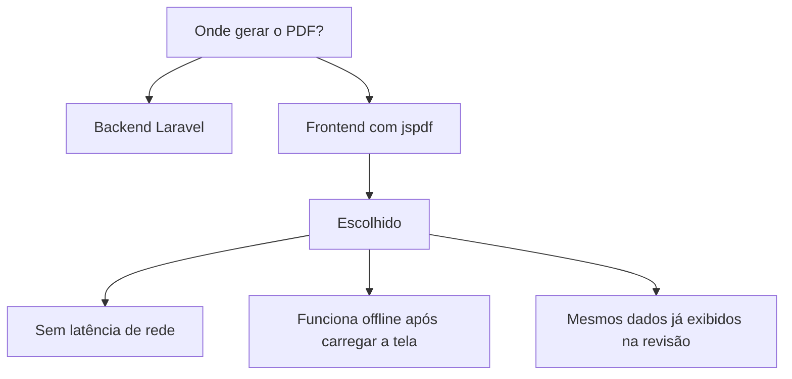

# Revisão e PDF da contratação (passo 6)

Documentação da etapa **Revisão** do wizard de Contratação de Serviços no Portal Fornecedor On Demand.

## Contexto

No passo 6, o usuário confere todos os dados preenchidos nas etapas anteriores antes de concluir o processo. A tela exibe um resumo estruturado (dados gerais, TR, QQP, anexos e solicitação de serviço). Além da visualização na interface, o usuário pode **baixar um PDF** com o mesmo conteúdo para arquivo, impressão ou compartilhamento interno.

A ação principal de encerramento do fluxo foi renomeada de **Submeter** para **Finalizar contratação**, alinhando a linguagem ao objetivo de negócio.

## Fluxo do wizard (6 passos)



## Experiência no passo 6

```mermaid
flowchart TB
  subgraph Tela["Passo 6 — Revisão"]
    R1[Resumo na tela]
    R2[Botão: Baixar PDF da revisão]
    R3[Botão: Finalizar contratação]
    R4[Botão: Salvar rascunho]
    R5[Botão: Anterior]
  end

  R1 --> R2
  R1 --> R3
  R3 --> API[POST /contratacao/{uuid}/submeter]
  R2 --> PDF[Geração local do PDF]
```

| Elemento | Comportamento |
|----------|---------------|
| Resumo na tela | Dados lidos do `ContratacaoWizardStore` (mesmo estado do formulário) |
| Baixar PDF da revisão | Gera PDF no navegador via `jspdf`, sem chamada ao backend |
| Finalizar contratação | Salva o rascunho e submete a solicitação (`store.submeter()`) |
| Salvar rascunho | Persiste na API sem submeter |

## Geração do PDF



### Conteúdo do PDF

1. Cabeçalho: Portal Fornecedor On Demand — Revisão da solicitação
2. Metadados: título, status, solicitante, data/hora de geração
3. Dados gerais
4. Termo de Referência (texto plano; HTML do editor é convertido)
5. Itens QQP com totais
6. Anexos (nomes dos arquivos)
7. Solicitação de serviço (quando preenchida)

O nome do arquivo segue o padrão: `revisao-contratacao-{titulo-slug}-{data}.pdf`.

## Arquivos envolvidos

| Arquivo | Responsabilidade |
|---------|------------------|
| `wizard/steps/revisao-step.component.*` | UI da revisão e botão de download |
| `wizard/contratacao-revisao-pdf.service.ts` | Montagem e exportação do PDF |
| `wizard/contratacao-wizard.store.ts` | `buildRevisaoPdfData()` e `submeter()` |
| `wizard/contratacao-wizard-shell.component.html` | Botão "Finalizar contratação" |

## Decisões técnicas



- **PDF no cliente:** evita nova rota no backend e reutiliza o estado já carregado no wizard.
- **HTML do TR:** convertido para texto no PDF (`stripHtml`) para layout previsível em múltiplas páginas.
- **Finalizar contratação:** mantém a lógica existente de validação + save + submissão; apenas o rótulo do botão mudou.

## Dependência

- `jspdf` — geração de PDF no navegador (Angular 17, bundle lazy do passo de revisão).
